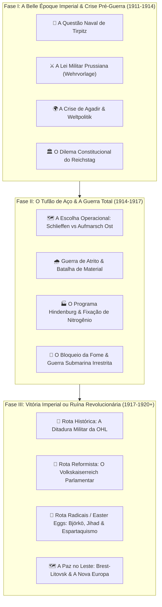
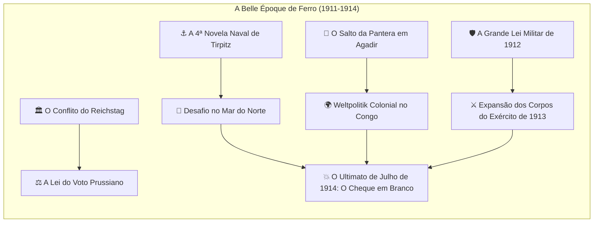
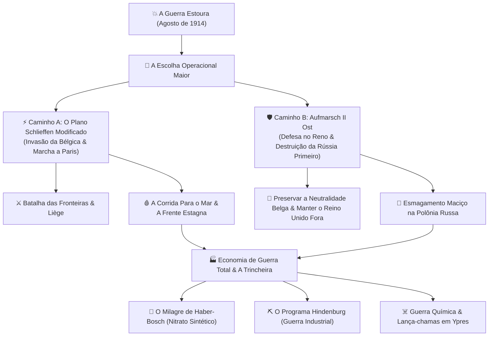
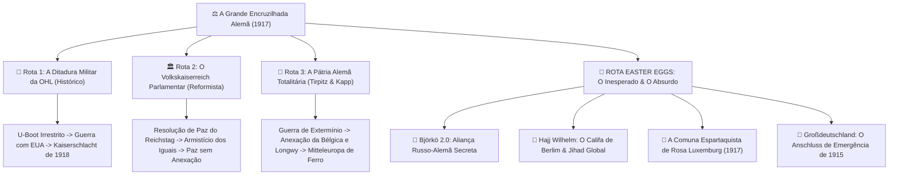

# 🦅 PLANO ARQUITETURAL GIGANTE: ÁRVORE DE FOCO DO IMPÉRIO ALEMÃO (*DEUTSCHES KAISERREICH*)

> **Identidade do Projeto**: *Baianagem-WW1*  
> **Nação Alvo**: Império Alemão (`GER`)  
> **Data de Início**: 1º de Junho de 1911  
> **Padrão de Qualidade**: Kaiserreich / The Great War Redux / The Fire Rises  
> **Filosofia**: Sem focos genéricos, ramificações de ramificações, profundidade histórica rigorosa, consequências visuais no mapa e rotas alternativas extremas (easter eggs).

---

## 🧭 1. Visão Geral da Arquitetura & Integração Mecânica

A Árvore de Foco da Alemanha será a espinha dorsal de todo o conflito europeu. Como a principal potência dos Poderes Centrais, cada decisão tomada em Berlim altera dinamicamente os focos da França, Grã-Bretanha, Rússia, Bélgica e Áustria-Hungria.

### 📊 Diagrama de Blocos Mestres:

---

## ⚙️ 2. Conciliação com os Modificadores Nacionais & Decisões

A nova árvore alemã interage diretamente com todos os espíritos e decisões já inseridos no mod:

| Espírito / Mecânica Existente | Efeito Inicial no Mod | Como a Árvore de Foco Modifica / Transforma |
| :--- | :--- | :--- |
| `GER_grosser_generalstab` | `+25% Plan Speed, +20% Max Plan, +10% Org` | Pode evoluir para o *Comando Supremo da OHL* (+15% Breakthrough) ou ser subordinado ao controle civil reformista. |
| `GER_krupp_chemical_conglomerates` | `+15% Fábricas, +15% Vel. Fáb. Mil, +8% Pesq` | Foco do *Processo Haber-Bosch* concede auto-suficiência de borracha/explosivos, cancelando as penalidades de bloqueio de salitre. |
| `GER_tirpitz_naval_ambition` | `+15% Estaleiros, +10% Ataque Capital` | Rota da Frota de Alto-Mar culmina na *Batalha de Jutlândia*; rota alternativa cancela encouraçados e foca 100% em U-Boots. |
| `GER_encirclement_paranoia` | `+15% War Support, +8% Supply Consumption` | Se a Alemanha for cercada, desbloqueia decisões patrióticas de emergência; se quebrar o cerco no Leste, é removido permanentemente. |
| `GER_burgfrieden_social_peace` | `+10% Estabilidade, +10% PP` | Quebra gradualmente conforme o *Inverno dos Nabos* avança; a rota reformista restaura a paz com o SPD, a rota da OHL instaura lei marcial. |
| `GER_turnip_winter_crisis` | `-20% Indústria, -15% Estabilidade/Org` | Focos de *Racionamento Central Imperial* e *Pilhagem de Grãos na Ucrânia* curam a fome e removem o espírito. |
| `german_infiltration_assault_idea` | Bônus tático Stosstruppen | Desbloqueado historicamente no foco *Táticas de Infiltração Hutier (1916)* com subunidades dedicadas. |
| `GER_kaiserschlacht_idea` | Bônus extremo de ofensiva final | Ativado pelo foco final *A Ofensiva da Paz de 1918 (Kaiserschlacht)* para romper a frente aliada. |

---

## 📅 3. FASE I: O Cenário Pré-Guerra (1911–1914)

Começando em junho de 1911, a Alemanha vive o auge de seu poder militar e industrial, mas sofre com isolamento diplomático e tensões internas entre a autocracia militar prussiana e os trabalhadores urbanos socialistas.

### Detalhamento dos Focos da Fase I:

#### 1. Ramo Naval & Colonial (Weltpolitik):
1. **`GER_agadir_crisis_gambit` — *O Salto da Pantera em Agadir (Julho de 1911)***:
   - *Custo*: 35 dias (foco rápido de crise).
   - *Efeito*: Envia a canhoneira *SMS Panther* para o porto marroquino de Agadir. Dispara evento de crise para a França e Grã-Bretanha.
   - *Desfecho*: Se a França ceder território no Congo Francês, a Alemanha ganha borracha e prestígio colonial (+10% Estabilidade). Se a Grã-Bretanha ameaçar guerra, a Alemanha pode recuar e ganhar ressentimento anti-britânico (+15% War Support).
2. **`GER_tirpitz_fourth_naval_bill` — *A Quarta Novela Naval de Tirpitz (1912)***:
   - *Custo*: 70 dias.
   - *Ícone*: `GFX_focus_GER_navy`
   - *Efeito*: Adiciona 3 Estaleiros Navais em Kiel e Wilhelmshaven; adiciona bônus de pesquisa de 100% para *Dreadnoughts 1912* (Classe Kaiser / König).
3. **`GER_berlin_baghdad_railway` — *A Ferrovia Berlim-Bagdá & Influência Sublime*:
   - *Custo*: 50 dias.
   - *Efeito*: Concede investimento de infraestrutura no Império Otomano; aproxima a Aliança Otomana-Alemã (+75 Opinião mútua); desbloqueia acesso preferencial ao petróleo de Mosul.

#### 2. Ramo Militar Continental:
4. **`GER_army_bill_1912` — *A Lei Militar de 1912 (Heeresvorlage)***:
   - *Custo*: 50 dias.
   - *Efeito*: Adiciona +80.000 de Manpower treinado; melhora a velocidade de mobilização em +15%.
5. **`GER_centenary_of_leipzig_1913` — *O Jubileu de Prata do Kaiser & Leipzig 1913*:
   - *Custo*: 50 dias.
   - *Efeito*: Inflama o patriotismo nacional; adiciona +100 de Poder Político e consolida `GER_burgfrieden_social_peace`.
6. **`GER_expand_heavy_howitzers` — *Os Obuses de Cerco Krupp de 420mm (Dicke Bertha)***:
   - *Custo*: 70 dias.
   - *Ícone*: `GFX_focus_GER_krupp`
   - *Efeito*: Concede a tecnologia de Artilharia Pesada de Cerco; adiciona bônus brutal de ataque contra fortes (+30% Fort Attack), crucial para esmagar as fortalezas belgas de Liège e Namur.

#### 3. O Ponto de Ignição:
7. **`GER_the_blank_cheque` — *O Cheque em Branco a Viena (Julho de 1914)***:
   - *Disponível se*: A Áustria-Hungria estiver em crise com a Sérvia (Assassinato de Sarajevo).
   - *Efeito*: Dispara o evento onde Wilhelm II garante apoio incondicional a Franz Joseph. Se a Rússia intervir em favor da Sérvia, a Alemanha declara guerra à Rússia, e a França mobiliza em seguida, deflagrando a **Primeira Guerra Mundial**.

---

## ⚔️ 4. FASE II: O Grande Conflito Operacional (1914–1917)

Com a guerra iniciada em agosto de 1914, o jogador enfrenta a decisão estratégica mais importante do jogo: como manobrar suas forças nos primeiros 40 dias.

### Ramos Operacionais:

#### Caminho A (Histórico): O Plano Schlieffen
- **`GER_execute_schlieffen_plan` — *Executar o Plano Schlieffen***:
  - *Condição*: Guerra com a França.
  - *Efeito*: Declaração de guerra imediata contra a Bélgica e Luxemburgo. Concede o espírito nacional temporário `GER_schlieffen_momentum` (+15% Velocidade de Divisão, +20% Breakthrough durante os primeiros 60 dias).
  - *Consequência Internacional*: A Grã-Bretanha recebe o evento *'A Neutralidade Belga foi Violada'* e entra na guerra ao lado da Entente.
- **`GER_smash_liege_forts` — *A Queda dos Fortes de Liège***:
  - *Efeito*: Destrói 3 níveis de fortes em Liège; remove atrito inicial e abre passagem para o 1º Exército de von Kluck.
- **`GER_the_miracle_of_tannenberg` — *O Triunfo de Tannenberg no Leste***:
  - *Efeito*: Gera o Marechal de Campo Paul von Hindenburg e o General Erich Ludendorff com atributos excepcionais de ataque e planejamento (+2 de Ataque e Doutrina de Cerco).

#### Caminho B (Alternativo Plausível): *Aufmarsch II Ost* (Foco no Leste)
- **`GER_aufmarsch_ost_focus` — *O Plano de Moltke o Velho: Esmagar a Rússia Primeiro***:
  - *Condição*: Rejeitar a invasão da Bélgica.
  - *Efeito*: Respeita a neutralidade da Bélgica e da Holanda. Fortifica a Alsácia-Lorena com fortes pesados (+3 níveis de trincheiras e fortes na fronteira francesa).
  - *Impacto Geopolítico Massivo*: **A Grã-Bretanha NÃO entra na guerra em 1914!** O parlamento britânico permanece dividido e adota neutralidade armada. A Alemanha transfere 80% do exército para a Prússia Oriental e Galícia para liquidar o exército czarista antes do inverno de 1915!

#### A Adaptação à Guerra Estagnada (Ambos os Caminhos):
- **`GER_haber_bosch_nitrogen_miracle` — *O Milagre Químico de Fritz Haber (Fixação de Nitrogênio)***:
  - *Efeito*: Remove a dependência do salitre chileno bloqueado pela Royal Navy; remove a penalidade de escassez de munições; adiciona +10% de produção de equipamentos de artilharia e infantaria.
- **`GER_chemical_warfare_initiative` — *A Nuvem Amarela em Ypres (Guerra com Cloro e Gás Mostarda)***:
  - *Efeito*: Desbloqueia a decisão de *Ataque com Gás Asfixiante*; se o inimigo não tiver pesquisado máscaras de gás, sofre penalidade imediata de -40% de organização.
- **`GER_hindenburg_program` — *O Programa Hindenburg de Guerra Total (1916)***:
  - *Efeito*: Subordina todas as indústrias civis ao esforço bélico; converte 10% das fábricas civis em militares; ativa o espírito `GER_hindenburg_program_victory`.
- **`GER_stosstruppen_tactics` — *A Gênese das Tropas de Tempestade (Stosstruppen)***:
  - *Ícone*: `GFX_ww1_nationalfocus_ironcross`
  - *Efeito*: Desbloqueia as companhias de suporte de lança-chamas (`support_flamethrowers`), bombeiros de sapa e concede o modificador `german_infiltration_assault_idea` (+25% Breakthrough em trincheiras).

---

## 🏛️ 5. FASE III: Ramificações Políticas & Rotas de Fim de Jogo (1917–1920+)

A partir do fatídico ano de 1917, com o *Inverno dos Nabos* castigando a população civil e a Rússia entrando em colapso revolucionário, a Alemanha atinge a encruzilhada política que definirá o futuro da Europa.

---

### 👑 Rota 1: A Ditadura Silenciosa da OHL (Histórico)
*A liderança militar afasta o poder civil. Ludendorff e Hindenburg tornam-se os governantes de fato da Alemanha em nome do Kaiser.*

1. **`GER_silent_dictatorship_ohl` — *A Proclamação da OHL de Hindenburg e Ludendorff***:
   - *Efeito*: Nomeia Paul von Hindenburg como conselheiro supremo de governo; estabilidade fixa em +15%, mas aumenta o custo de leis civis.
2. **`GER_unrestricted_submarine_warfare` — *Guerra Submarina Irrestrita Total***:
   - *Efeito*: A marinha de U-Boots ataca qualquer navio neutro comerciando com a Grã-Bretanha. Causa penalidade devastadora na economia britânica (-30% Convoios, -25% Suprimentos).
   - *Risco Histórico*: Dispara o evento de tensão diplomática com os Estados Unidos (Telegrama Zimmermann / Lusitania), aproximando a entrada de Woodrow Wilson na Entente.
3. **`GER_sealed_train_to_petrograd` — *O Vagão Selado Para Petrogrado (O Retorno de Lenin)***:
   - *Condição*: A Rússia estar em revolta ou após a Revolução de Fevereiro.
   - *Efeito*: Envia Vladimir Lenin da Suíça através do território alemão até a Finlândia. Aumenta a velocidade da Revolução Bolchevique russa em +50%!
4. **`GER_treaty_of_brest_litovsk` — *A Paz de Brest-Litovsk (Março de 1918)***:
   - *Condição*: A Rússia capitular ou aceitar armistício.
   - *Transformação Visual no Mapa*:
     - A Rússia cede os territórios ocidentais.
     - Criação de **Ober Ost** (administração militar alemã no Báltico com bandeira de cruz negra e tag `GER_ober_ost`).
     - Liberação do **Reino da Polônia** (`POL`) como protetorado vassalo.
     - Criação do **Hetmanato da Ucrânia** (`UKR`) sob Pavlo Skoropadsky, que passa a enviar 200.000 toneladas de trigo para a Alemanha, **eliminando definitivamente o Inverno dos Nabos (`GER_turnip_winter_crisis`)**!
5. **`GER_the_kaiserschlacht_1918` — *A Ofensiva Imperial Final da Primavera (Kaiserschlacht)***:
   - *Efeito*: Transfere 50 divisões veteranas do Leste para o Oeste; ativa a decisão de super-ofensiva de ruptura para tomar Paris antes que os americanos desembarquem em massa.

---

### 🏛️ Rota 2: O *Volkskaiserreich* Constitucional Reformista
*O Chanceler Theobald von Bethmann-Hollweg consegue frear a loucura militar da OHL, une-se aos social-democratas moderados (SPD) e liberais do Zentrum, e reforma o Império em uma verdadeira monarquia parlamentar moderna.*

1. **`GER_bethmann_civilian_supremacy` — *A Supremacia da Chancelaria Civil sobre a OHL***:
   - *Efeito*: Bloqueia a guerra submarina irrestrita (evita a entrada dos EUA na guerra!); demite Erich Ludendorff do comando geral.
2. **`GER_prussian_franchise_reform` — *Abolição do Voto Prussiano de Três Classes*:
   - *Efeito*: Concede voto igualitário e democrático na Prússia; o SPD entra formalmente na coalizão ministerial; estabilidade sobe para 85%; greves cessam completamente.
3. **`GER_reichstag_peace_resolution` — *A Resolução de Paz do Reichstag de Julho de 1917***:
   - *Efeito*: A Alemanha aprova oficialmente uma declaração internacional buscando *'Uma Paz de Entendimento Sem Anexações Forçadas'*.
   - *Consequência Diplomática*: Dispara conferências secretas de paz na Suíça com a Grã-Bretanha e a França; permite um armistício branco caso o front ocidental esteja em impasse.
4. **`GER_constitutional_monarchy_proclamation` — *A Proclamação da Monarquia Parlamentar*:
   - *Transformação Cosmética*: O Kaiser Wilhelm II abdica de seus poderes absolutistas em favor do Parlamento (estilo Reino Unido); o país ganha a tag cosmética de Monarquia Constitucional, mantendo a estabilidade e salvando o império do colapso republicano de 1918.

---

### 🏴 Rota 3: A Pátria Alemã Totalitária (*Deutsche Vaterlandspartei*)
*A burguesia conservadora extrema, apoiada por Tirpitz e Wolfgang Kapp, afasta o Kaiser hesitante e instaura uma ditadura anexionista de guerra total.*

1. **`GER_found_vaterlandspartei` — *A Fundação do Partido da Pátria Alemã (1917)***:
   - *Efeito*: Militarização total da sociedade; repressão violenta contra sindicatos e socialistas; dissolução do Reichstag.
2. **`GER_total_war_mobilization` — *Mobilização da Força de Trabalho Feminina e Compulsória*:
   - *Efeito*: Recrutamento compulsório de toda a população de 15 a 60 anos; adiciona +3% de População Recrutável; penalidade de -10% de estabilidade por medidas draconianas.
3. **`GER_annexation_of_belgium_and_briey` — *A Anexação Permanente da Bélgica e Bacia de Briey***:
   - *Efeito*: A Alemanha formalmente declara a anexação perpétua das jazidas de ferro francesas de Briey-Longwy e transforma a Bélgica em uma colônia imperial alemã com deportação de indústrias.
4. **`GER_morphed_mitteleuropa_iron_rule` — *A Mitteleuropa sob o Tacão de Ferro*:
   - *Efeito no Mapa*: Todas as nações da Europa Central (Áustria, Hungria, Polônia, Romênia, Bulgária) são forçadas a integrar um protetorado militar unificado sob comando exclusivo de Berlim.

---

## 🌟 6. ROTAS ESPECIAIS & EASTER EGGS ("Coisas Doidas")

Para atender à solicitação de mecânicas alternativas audaciosas e surpreendentes, criamos 4 rotas de alta criatividade, rigorosamente viáveis na engine:

### 🤝 Easter Egg 1: *Björkö 2.0 — A Aliança dos Três Imperadores Renascida*
- **Fundamento Histórico**: Em 1905, o Kaiser Wilhelm II e o Czar Nicolau II assinaram secretamente o Tratado de Björkö no iate imperial, quase unindo Alemanha e Rússia antes de seus chanceleres entrarem em pânico e revogarem o acordo.
- **O Foco**: `GER_willy_nicky_telegrams_bjorko` — *Os Telegramas de Willy e Nicky (Björkö 2.0)*.
- **Como Desbloquear**: Em 1911–1914, o jogador pode enviar ofertas secretas a Petrogrado. Se a Alemanha prometer apoiar os interesses russos em Constantinopla e nos Estreitos, a Rússia rompe com a França!
- **O Efeito no Mapa**:
  - A Alemanha abandona a aliança com a Áustria-Hungria!
  - Uma nova facção é criada: **A Liga dos Três Imperadores (Pacto Berlim-São Petersburgo)**!
  - Alemanha e Rússia invadem a França e o Império Britânico juntas, dividindo o globo entre a autocracia germânica e russa!

---

### 🕌 Easter Egg 2: *Hajj Wilhelm — A Guerra Santa Global do Kaiser*
- **Fundamento Histórico**: Max von Oppenheim convenceu a corte de Berlim de que proclamar um Jihad islâmico através do Sultão/Califa otomano inflamaria milhões de muçulmanos no Império Britânico (Índia e Egito) e no Império Russo (Ásia Central). Wilhelm II chegou a ser chamado ironicamente de "Haji Wilhelm Mohammed".
- **O Foco**: `GER_hajj_wilhelm_pan_islamic_crusade` — *A Proclamação da Guerra Santa Imperial*.
- **Efeitos In-Game**:
  - A Alemanha recebe a bandeira híbrida com a Águia Imperial e o Crescente Otomano.
  - Insurreições islâmicas instantâneas estouram no Egito (Suez bloqueado para a Grã-Bretanha) e na Índia Britânica (tropas rebeldes se erguem no Noroeste).
  - Unidades de Cavalaria Beduína e Dervixes são criadas como voluntários na própria Alemanha, lutando lado a lado com os prussianos nas trincheiras de Verdun!

---

### 🚩 Easter Egg 3: *A Comuna Espartaquista de 1917 (Der Rote Kaiser Derrubado)*
- **Como Desbloquear**: Se a Alemanha sofrer mais de 2 milhões de baixas, o espírito `GER_turnip_winter_crisis_3` estiver ativo e a estabilidade estiver abaixo de 20%, a revolução estoura ANTES do fim da guerra.
- **O Foco**: `GER_spartakusbund_proletarian_revolt` — *A Revolta dos Espartaquistas de Berlim*.
- **Efeitos no Mapa**:
  - O Kaiser Wilhelm II foge para a Holanda.
  - Rosa Luxemburg e Karl Liebknecht assumem o governo e proclamam a **República Socialista Livre da Alemanha (`GER_socialist`)**.
  - O país assina armistício imediato com a Rússia Soviética de Lenin e vira suas tropas contra os exércitos capitalistas britânico e francês em uma Guerra de Libertação Proletária!

---

### 🦅 Easter Egg 4: *Großdeutschland — O Anschluss Antecipado de 1915*
- **Fundamento Histórico**: Se o Império Austro-Húngaro entrasse em colapso militar completo na Galícia contra a Rússia em 1914/1915, os generais prussianos planejavam ocupar militarmente a Áustria para salvar a frente.
- **O Foco**: `GER_emergency_danubian_annexation` — *A Intervenção de Emergência nos Territórios Habsburgos*.
- **Como Desbloquear**: A Áustria-Hungria capitular ou perder Viena e a Galícia.
- **Efeitos no Mapa**:
  - A Alemanha intervém, destrona a dinastia Habsburgo e **anexa diretamente Viena, Tirol, Salzburgo e as províncias austríacas de língua alemã**, antecipando o *Großdeutschland* em 23 anos!
  - A Boêmia e a Morávia tornam-se protetorados imperiais e a Hungria é forçada a assinar sua independência.

---

## 🎨 7. Catálogo de Ícones GFX Mapeados

Todos os focos usarão os ícones customizados já existentes no mod e no acervo de alta qualidade:

| ID do Foco | Sprite / Ícone GFX | Arquivo Fonte / Aparência |
| :--- | :--- | :--- |
| `GER_execute_schlieffen_plan` | `GFX_focus_ger_around_maginot` | Flecha contornando fortificações sobre mapa |
| `GER_smash_liege_forts` | `GFX_ww1_mex_upca_conquer` | Obus explodindo parapeito de fortaleza |
| `GER_hindenburg_program` | `GFX_focus_OHL` | Brasão oficial da Oberste Heeresleitung |
| `GER_expand_heavy_howitzers` | `GFX_focus_GER_krupp` | Logotipo e forja da Krupp Essen |
| `GER_tirpitz_fourth_naval_bill` | `GFX_focus_GER_navy` | Encouraçado Dreadnought navegando em linha |
| `GER_stosstruppen_tactics` | `GFX_ww1_nationalfocus_ironcross` | Cruz de Ferro negra com capacete Stahlhelm |
| `GER_chemical_warfare_initiative` | `GFX_ww1_nationalfocus_gasmask` | Soldado de trincheira com máscara de gás M15 |
| `GER_treaty_of_brest_litovsk` | `GFX_goal_deal_with_german_empire` | Caneta assinando tratado sobre mapa da Europa Oriental |
| `GER_the_blank_cheque` | `GFX_focus_ger_support_austrian_claims` | Águias imperial alemã e bicéfala austríaca unidas |
| `GER_spartakusbund_proletarian_revolt` | `GFX_goal_generic_workers` | Foice e tocha sobre a bandeira vermelha |
| `GER_hajj_wilhelm_pan_islamic_crusade` | `GFX_ww1_nationalfocus_islam` | Crescente dourado islâmico com a coroa do Kaiser |

---

## 📋 8. Resumo da Implementação Técnica

1. **Arquivo da Árvore**: `WW1/common/national_focus/germany.txt` (substituindo o arquivo vazio atual de 67 bytes).
2. **Localização**: `WW1/localisation/english/ww1_germany_focus_l_english.yml` e `ww1_germany_focus_l_braz_por.yml` (UTF-8 com BOM).
3. **Interface**: `WW1/interface/ww1_germany_goals.gfx` (registrando todos os sprites mapeados).
4. **Eventos de Conexão**: Disparo de eventos diplomáticos em `ww1_crisis_on_actions.txt` e `ww1_trench_decisions.txt`.

---

## 📌 Próximos Passos
O plano detalhado da árvore alemã está desenhado para aprovação. Assim que você der o sinal verde, iniciaremos a codificação da árvore de foco alemã completa e sua sincronização direta com o seu jogo na Steam!
