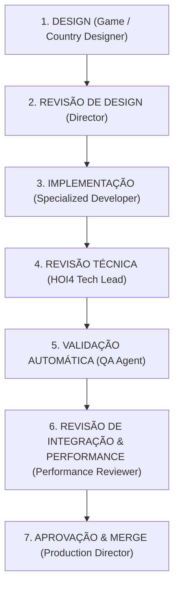

# Baianagem-WW1 — Arquitetura Técnica & Organização Multiagente

## 1. Organização dos Diretórios do Mod

O projeto respeita rigorosamente o padrão de mods da Clausewitz Engine para Hearts of Iron IV:

```text
Baianagem-WW1/WW1/
├── .agents/                    # Regras, Skills e Especificações dos Agentes
│   ├── rules/                  # Políticas permanentes de engenharia e modding
│   ├── skills/                 # Guias operacionais especializados
│   └── agents/                 # Definições de papéis e responsabilidades
├── common/                     # Definições centrais do jogo
│   ├── bookmarks/              # Datas de início (1914 / cenários específicos)
│   ├── characters/             # Líderes, generais e conselheiros (sistema moderno NSB+)
│   ├── countries/              # Cores e configurações cosméticas dos países
│   ├── country_leader/         # Traits de líderes
│   ├── decisions/              # Decisões e categorias
│   ├── defines/                # Overrides de parâmetros em Lua (NDefines)
│   ├── ideas/                  # Ideias nacionais, leis e conselheiros
│   ├── national_focus/         # Árvores de focos nacionais
│   ├── on_actions/             # Gatilhos disparados por eventos do motor
│   ├── scripted_effects/       # Efeitos reutilizáveis com parâmetros
│   ├── scripted_triggers/      # Gatilhos reutilizáveis
│   ├── scripted_guis/          # Lógica de interface dinâmica
│   └── units/                  # Subunidades, módulos e equipamentos
├── events/                     # Eventos de país e notícias
├── gfx/                        # Texturas (.dds, .tga, .png), modelos e ícones
├── history/
│   ├── countries/              # História inicial por TAG (tecnologias, leis, líderes)
│   ├── states/                 # Províncias, construções e recursos por estado
│   └── units/                  # Ordem de Batalha inicial (OOB)
├── interface/                  # Arquivos .gui e declarações .gfx (spriteType)
├── localisation/
│   └── english/                # Arquivos YAML (UTF-8 com BOM)
└── map/                        # Definições cartográficas, províncias e regiões
```

---

## 2. Estrutura e Governança Multiagente

Para garantir qualidade e sustentabilidade, o desenvolvimento adota divisão de responsabilidades estrita.

### Pipeline de Entrega


### Regra Fundamental
> **Quem implementa NÃO aprova seu próprio conteúdo.**  
> Nenhuma funcionalidade é dada como concluída sem validação sintática, verificação de referências cruzadas e aprovação formal.

---

## 3. Papéis dos Agentes Especializados

| Papel | Responsabilidade Principal |
| :--- | :--- |
| **Project Director / Lead Dev** | Visão geral, alinhamento com o usuário, triagem de tarefas, integração final e merge. |
| **HOI4 Technical Lead** | Validação de sintaxe, scopes, compatibilidade com HOI4 1.19.3 e padronização de código. |
| **Game Designer** | Concepção de mecânicas de jogo, equilíbrio histórico e progressão de gameplay. |
| **Country & Focus Designer** | Elaboração da narrativa, estrutura lógica e árvores de foco sem "fillers". |
| **Event & Decision Designer** | Roteirização de eventos com namespaces consistentes, triggers válidos e opções com impacto real. |
| **Mechanics / Systems Engineer** | Implementação de sistemas profundos (scripted guis, scripted effects/triggers, variáveis). |
| **AI & Balance Designer** | IA comportamental (`ai_will_do`, `ai_weights`, estratégias de produção e guerra). |
| **GFX & Interface Specialist** | Registro de sprites (.gfx), interfaces (.gui) e consistência visual de texturas. |
| **Localisation Specialist** | Redação imersiva, chaves de texto, tooltips dinâmicos e formato UTF-8 BOM. |
| **Performance Reviewer** | Auditoria de loops caros (`every_country`, `every_state`), defines e uso de CPU. |
| **QA / Validation Agent** | Scripts automáticos para checar chaves desbalanceadas, IDs duplicados e referências nulas. |

---

## 4. Padrões Técnicos Obrigatórios (HOI4 1.19.3)

1. **Modifiers Atualizados**:
   - Bens de consumo devem utilizar `consumer_goods_expected_value = <float>` (nunca o obsoleto `consumer_goods_factor`).
2. **Sistema de Personagens**:
   - Todo novo líder, general e conselheiro deve ser estruturado em `common/characters/[TAG].txt` com `country_leader`, `corps_commander`, `field_marshal` ou `advisor`, sendo recrutado com `recruit_character = [TAG_token]`.
3. **Localização**:
   - Todos os arquivos `.yml` devem residir obrigatoriamente em `localisation/english/` (ou idioma alvo), iniciar com `l_english:` na linha 1 e ser codificados estritamente em **UTF-8 com BOM**.
4. **Interface & Sprites**:
   - Todo elemento gráfico referenciado em `.gui` ou scripts (`picture = ...`, `icon = ...`) deve ter sua definição correspondente em um arquivo `interface/*.gfx` via `spriteType`.
5. **Git e Concorrência**:
   - Antes de iniciar modificações, checar `git status` e `git log`.
   - Modificações devem ser organizadas em commits atômicos, focados e sem alterações desnecessárias de arquivos alheios.
