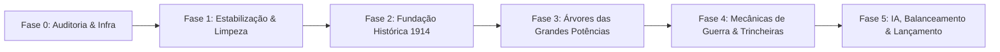

# Baianagem-WW1 — Roadmap de Desenvolvimento

Este roadmap estabelece os marcos de desenvolvimento planejados para o mod, partindo da estabilização da base herdada até o lançamento da experiência completa de Primeira Guerra Mundial.

---

## Fases de Desenvolvimento

---

### Fase 0: Auditoria e Fundação Multiagente [CONCLUÍDA]
- [x] Auditoria estrutural exaustiva de todos os arquivos e diretórios.
- [x] Inventário de dívida técnica, bugs sintáticos e anomalias de conteúdo.
- [x] Estabelecimento da governança multiagente e regras operacionais.
- [x] Criação de `PROJECT.md`, `ARCHITECTURE.md`, `ROADMAP.md`, `CHANGELOG.md` e infraestrutura `.agents/`.

---

### Fase 1: Estabilização Técnica e Resolução da Dívida Herdada
*Objetivo: Eliminar erros que impedem o carregamento limpo e seguro do mod no HOI4 1.19.3.*
- [ ] Implementar o scripted effect de contingência `MBR_grant_level_one_technologies` ou sanear sua chamada nos 369 países.
- [ ] Corrigir chaves desbalanceadas:
  - 18 arquivos em `history/countries/` com chave extra no final.
  - `common/ideas/specialforces_ideas.txt` (chaves abertas).
  - Arquivos OOB com chaves desbalanceadas.
- [ ] Eliminar sintaxe de comentário inválida (substituir `--` por `#` em `specialforces_decisions.txt` e afins).
- [ ] Atualizar modifiers depreciados (`consumer_goods_factor` -> `consumer_goods_expected_value`).
- [ ] Corrigir declarações de sprites pendentes (`GFX_ww_stateview_bg` e `GFX_idea_MBR_Central_Powers`).
- [ ] Padronizar arquivos de localização (mover os que estão na raiz de `localisation/` para `localisation/english/`, corrigir `.txt` para `.yml`).
- [ ] Sanear referências a equipamentos inexistentes (`helicopter_equipment`, etc.).

---

### Fase 2: Fundação Histórica da WW1 (1914 Baseline)
*Objetivo: Estabelecer o cenário geopolítico e militar do início da Grande Guerra.*
- [ ] Bookmark de 1914 ("A Grande Guerra" / "The Great War"):
  - Ajuste de data e apresentação das principais potências.
- [ ] Saneamento de lideranças e política:
  - Substituição definitiva de líderes modernos (ex.: Edi Rama, Friedrich Merz) pelos chefes de estado e ministros históricos de 1914.
- [ ] Revisão de fronteiras e alianças de 1914:
  - Potências Centrais (Alemanha, Áustria-Hungria, Império Otomano, Bulgária).
  - Tríplice Entente (França, Império Britânico, Império Russo, Sérvia, Bélgica).
- [ ] Ajuste inicial de OOBs (remover templates idênticos de 1936 genéricos e configurar exércitos de época).

---

### Fase 3: Árvores de Foco das Grandes Potências
*Objetivo: Dotar cada nação protagonista de caminhos históricos e plausíveis caminhos alternativos sem árvores genéricas de enchimento.*
- [ ] **Alemanha (GER)**: Plano Schlieffen, Guerra Submarina Irrestrita, Frente Oriental, Linha Hindenburg, opções monárquicas/republicanas.
- [ ] **França (FRA)**: Plano XVII, Sagrada União, Batalha das Fronteiras, Trincheiras de Verdun, diplomacia colonial.
- [ ] **Império Britânico (ENG)**: Bloqueio Naval da Marinha Real, Corpo Expedicionário Britânico (BEF), Gallipoli, mobilização imperial.
- [ ] **Império Russo (RUS)**: Ofensiva Brusilov, instabilidade interna da Duma, ferrovias estratégicas, crise da Revolução de 1917.
- [ ] **Áustria-Hungria (AUS/AH)**: Conflito nos Bálcãs, Frente do Isonzo, tensões étnicas da Monarquia Dual.
- [ ] **Império Otomano (TUR/OTT)**: Dardanelos, Frente da Mesopotâmia, Revolta Árabe, modernização dos Jovens Turcos.

---

### Fase 4: Sistemas e Mecânicas de Guerra da Primeira Guerra Mundial
*Objetivo: Criar sistemas reais que emulem o combate e a logística da Grande Guerra.*
- [ ] **Sistema de Guerra de Trincheiras**: Dinâmica de entrincheiramento profundo, desgaste de artilharia e quebra de frentes estáticas.
- [ ] **Bloqueio Naval e Fome Industrial**: Impacto do bloqueio marítimo na estabilidade e produção de bens de consumo.
- [ ] **Guerra Química (Gás Tóxico)**: Decisões e contramedidas táticas de emprego de gás de cloro e mostarda.
- [ ] **Exaustão de Guerra (War Weariness)**: Crises de moral, motins e colapso social em conflitos prolongados.

---

### Fase 5: IA, Balanceamento, Otimização e Lançamento
*Objetivo: Teste exaustivo, garantia de alta performance e polimento para publicação.*
- [ ] Estratégias de IA históricas e alternativas com `ai_will_do` balanceados.
- [ ] Auditoria de performance para assegurar que nenhum sistema sobrecarregue ticks de hora/dia.
- [ ] Verificação de integridade 100% livre de erros no `error.log`.
- [ ] Preparação para publicação e atualização na Steam Workshop.
